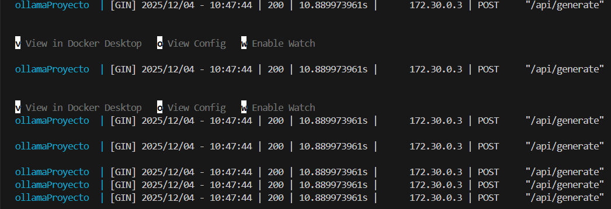
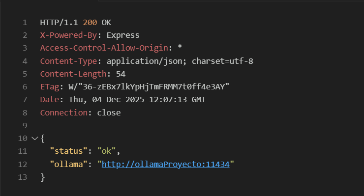
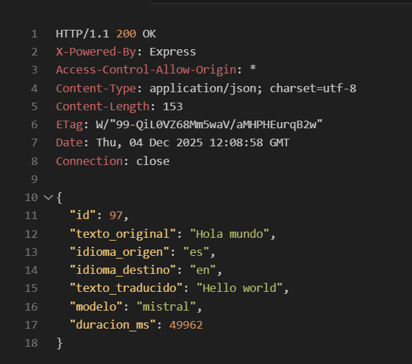
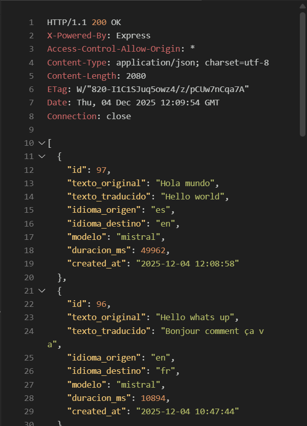
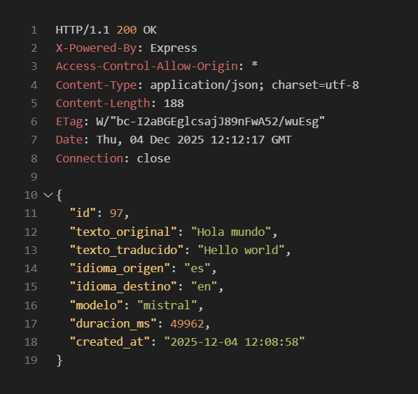
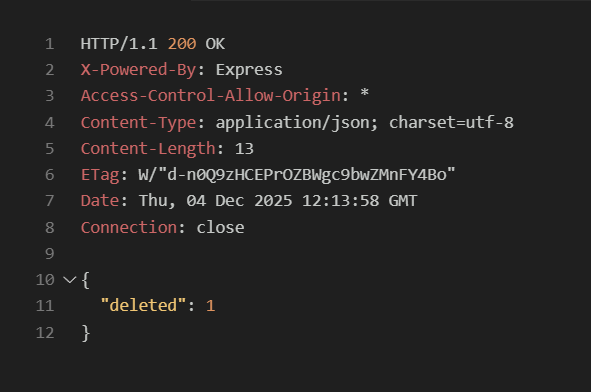
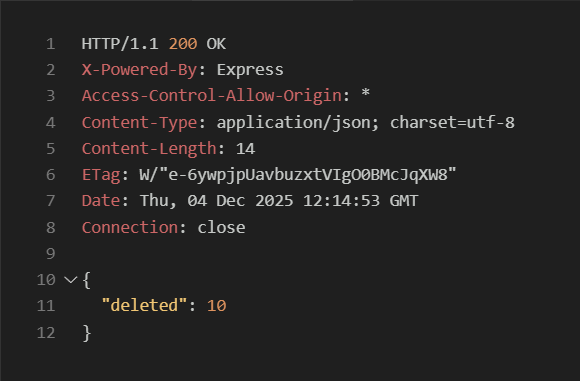
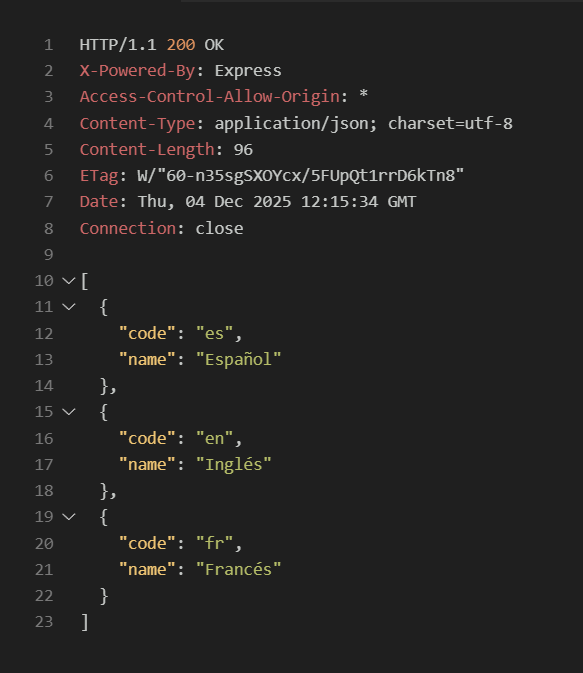
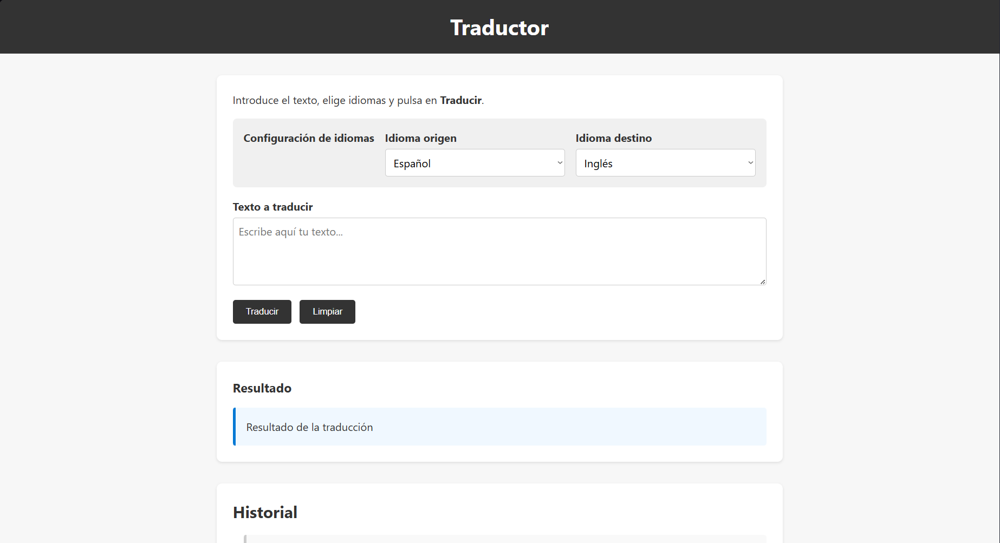

## 🌍 Traductor Inteligente (es / en / fr)

Aplicación que traduce textos entre Español, Inglés y Francés, integrada con Ollama como IA local y SQLite3 como base de datos para tener un historial de traducciones.

El proyecto tiene:

- Backend en `Node.js + Express` que expone una API REST y se conecta a Ollama.
- Base de datos `SQLite3` gestionada con better-sqlite3.
- Frontend en JavaScript que consume la API y muestra historial.
- Docker Compose para levantar backend, frontend y servicio de Ollama.

## 👥 Autores

- **Ian Álvarez Triviño**
- **Sergio Ramírez Morón**

## 📄 Índice

1. [Requisitos del sistema](#requisitos-del-sistema)
2. [Estructura de carpetas](#estructura-de-carpetas)
3. [Tecnologías principales](#tecnologias-principales)
4. [Variables de entorno](#variables-de-entorno)
5. [Instalación](#instalación)
6. [Ejecución sin Docker](#ejecución-sin-docker)
7. [Ejecución con Docker Compose](#ejecución-con-docker-compose)
8. [API REST – Endpoints](#api-rest-endpoints)
9. [Lógica del backend y la base de datos](#lógica-del-backend-y-la-bd)
10. [Frontend](#frontend-html-css-js)
11. [Archivo de validación](#archivo-validacionhttp)
12. [Decisiones de diseño](#decisiones-de-diseño)
13. [Limitaciones conocidas](#limitaciones-conocidas)
14. [Extensiones futuras](#extensiones-futuras)
15. [Git y workflow](#git-y-workflow)

## Requisitos del sistema

- **Node.js**: v20+
- **npm**: v10+
- **Docker**: 24+
- **Docker Compose**: V2
- **Ollama** instalado localmente con un modelo de lenguaje:
  - **Modelo**: `mistral`

## Estructura de carpetas

```text
traductor-ia-IanAT-SergioRM/
│
├── backend/
│   ├── server.js        # Servidor Express
│   ├── routes.js        # Rutas de la API REST
│   ├── services.js      # Lógica con Ollama y acceso a la BD
│   ├── db.js            # Inicialización y conexión SQLite3
│   ├── db/
│   │   └── traducciones.db  # Base de datos SQLite3
│   ├── Dockerfile       # Imagen Docker del backend
│   ├── .dockerignore    # Archivos que Docker va a ignorar
│   ├── package.json     # Dependencias y scripts del backend
│   └── package-lock.json
│
├── frontend/
│   ├── index.html       # Interfaz principal del traductor
│   ├── style.css        # Estilos CSS
│   ├── main.js          # Lógica de interacción con la API y UI
│   ├── Dockerfile       # Imagen Docker del frontend
│   └── images/          # Capturas de pantalla
│
├── validacion.http       # Peticiones de prueba a la API
├── docker-compose.yml    # Docker compose del backend, frontend y Ollama
├── docs/
│   └── checklist.md      # Checklist
├── README.md             # Descripción del documento
```

---

## Tecnologías principales

- **Backend**:
  - `Node.js`, `Express`
  - `better-sqlite3`
  - `dotenv`, `cors`
- **Frontend**:
  - HTML, CSS
  - JavaScript con fetch para consumir la API
- **IA**:
  - **Ollama** con modelo mistral
- **Estrucura Final**:
  - Docker + Docker Compose

---

## Variables de entorno

Se usa un archivo `.env`. Debes crear primero un `.env.example` y luego copiarlo a `.env` para que funcione.

### `.env.example` recomendado

```bash
# Backend
PORT=3000

# Ollama en local
OLLAMA_URL=http://localhost:11434
OLLAMA_MODEL=mistral

# Puertos expuestos por Docker Compose
BACKEND_PORT=3000
FRONTEND_PORT=5173
OLLAMA_PORT=11434
```

- **En local**:
  - El backend usará `PORT` y `OLLAMA_URL=http://localhost:11434`.
- **En Docker**:

  - El backend debe usar `OLLAMA_URL=http://ollama:11434`.
  - Los puertos `BACKEND_PORT`, `FRONTEND_PORT`, `OLLAMA_PORT` controlan `localhost`.

## Instalación

### 1. Clonar el repositorio

```bash
git clone <URL_DEL_REPOSITORIO>
cd traductor-ia-IanAT-SergioRM
```

### 2. Configurar `.env`

```bash
cp .env.example .env
```

### 3. Instalar modelo mistral

```bash
ollama pull mistral
```

## Ejecución sin Docker

### 1. Lanzar Ollama

En una terminal:

```bash
ollama serve
```

### 2. Lanzar backend

En otra terminal:

```bash
cd backend
npm run dev
```

- El backend escucha al puerto definido en `PORT`.

### 3. Lanzar frontend

El frontend es estático, por lo que se recomienda abrirlo con liveServer o abrirlo en el navegador directamente.

- **Recomendación**: servirlo con un servidor estático (extensión Live Server):

El frontend llama a las siguientes URL por defecto:

- `http://localhost:3000/api/translate`
- `http://localhost:3000/api/translations`

Asegúrate de que el backend esté corriendo en ese puerto, si no, no funcionará.

## Ejecución con Docker Compose

Desde la **raíz del proyecto** ejecutamos:

```bash
docker compose up --build
```

El `docker-compose.yml` levanta tiene que levantar tres servicios:

- **backend**:
  - Ruta creación Dockerfile: `backend/Dockerfile`
  - Se usa `BACKEND_PORT:3000` (por defecto usamos el puerto `3000:3000`)
  - Usa `.env` para configuración
- **frontend**:
  - Ruta creación Dockerfile: `frontend/Dockerfile`
  - Se usa `FRONTEND_PORT:5173` (por defecto usamos el puerto `5173:5173`)
- **ollama**:
  - La imagen que instalamos `ollama/ollama:latest`
  - Se usa `OLLAMA_PORT:11434` (por defecto usamos el puerto `11434:11434`)
    

## API REST – Endpoints

Todos los endpoints tienen un `/api` delante.

### GET `/api/health`

- **Objetivo**: Comprobar que el backend está levantado y ver la URL de Ollama.

**Respuesta (200):**

```json
{
  "status": "ok",
  "ollama": "http://localhost:11434"
}
```



---

### POST `/api/translate`

- **Objetivo**: Traducir un texto usando Ollama y guardar la traducción en la base de datos.

**Body:**

```json
{
  "text": "Hola mundo",
  "sourceLang": "es",
  "targetLang": "en"
}
```

**Validaciones:**

- **`text`**:
  - No puede estar vacío ni ser solo espacios.
  - Máximo 5000 caracteres.
- **`sourceLang` y `targetLang`**:
  - Deben ser uno entre: `"es"`, `"en"`, `"fr"`.
  - No pueden ser iguales.

**Respuesta (200) ejemplo:**

```json
{
  "id": 1,
  "texto_original": "Hola mundo",
  "idioma_origen": "es",
  "idioma_destino": "en",
  "texto_traducido": "Hello world",
  "modelo": "mistral",
  "duracion_ms": 2500
}
```

## 

### GET `/api/translations`

- **Objetivo**: Obtener el historial de traducciones.

**Parámetros:**

- `sourceLang` – Filtrar por idioma origen (`es`, `en`, `fr`).
- `targetLang` – Filtrar por idioma destino (`es`, `en`, `fr`).

**Ejemplos de uso:**

- `GET /api/translations` → Todas las traducciones.
- `GET /api/translations?sourceLang=es` → Solo traducciones que salen de español.
- `GET /api/translations?targetLang=en` → Solo traducciones que van a inglés.
- `GET /api/translations?sourceLang=es&targetLang=en` → Solo traducciones que van del español al inglés.

**Respuesta (200) ejemplo:**

```json
[
  {
    "id": 3,
    "texto_original": "Bonjour",
    "texto_traducido": "Hello",
    "idioma_origen": "fr",
    "idioma_destino": "en",
    "modelo": "mistral",
    "duracion_ms": 1300,
    "created_at": "2025-12-04 10:23:45"
  }
]
```

## 

### GET `/api/translations/:id`

- **Objetivo**: Obtener una traducción por su `id`.

**Ejemplo:**

```http
GET /api/translations/1
```

**Respuesta (200) ejemplo:**

```json
{
  "id": 1,
  "texto_original": "Hola mundo",
  "texto_traducido": "Hello world",
  "idioma_origen": "es",
  "idioma_destino": "en",
  "modelo": "mistral",
  "duracion_ms": 2500,
  "created_at": "2025-12-04 09:15:00"
}
```

## 

### DELETE `/api/translations/:id`

- **Objetivo**: Eliminar una traducción del historial.

**Ejemplo:**

```http
DELETE /api/translations/5
```

**Respuesta (200):**

```json
{ "deleted": 1 }
```

- `deleted: 1`: Significa que se ha borrado una fila.
- `deleted: 0`: Significa que no existe una traducción con ese id.

## 

### DELETE `/api/translations`

- **Objetivo**: Limpia todo el historial de traducciones.

**Ejemplo:**

```http
DELETE /api/translations
```



**Respuesta (200):**

```json
{ "deleted": 47 }
```

---

### GET `/api/languages`

- **Objetivo**: Obtener la lista de idiomas que se pueden utilizar.

**Respuesta (200):**

```json
[
  { "code": "es", "name": "Español" },
  { "code": "en", "name": "Inglés" },
  { "code": "fr", "name": "Francés" }
]
```



## Lógica del backend y la BD

- **`db.js`**:
  - Creamos la BD en `backend/db/traducciones.db`.
  - Creamos la tabla `traducciones` con:
    - `id`, `texto_original`, `texto_traducido`, `idioma_origen`, `idioma_destino`,
      `modelo`, `duracion_ms`, `created_at`.
- **`services.js`**:
  - `validarIdioma(codigo)`: comprueba si el código está en `["es","en","fr"]`.
  - `traducir(text, sourceLang, targetLang)`:
    - Comprueba las entradas, construye el prompt para Ollama, mide el tiempo que tarda,
      lo guarda en la BD y devuelve los metadatos.
  - `obtenerTraducciones(filtros)`: usa filtros por idioma y límite de resultados que hay por ese idioma.
  - `obtenerTraduccionPorId(id)`: recupera una traducción por id, y si no funciona, lanza un error
  - `eliminarTraduccion(id)`: elimina una traducción con dicha id.
  - `limpiarHistorial()`: borra todas las traducciones de la tabla.

## Frontend (HTML, CSS, JS)

- **`index.html`**:

  - Formulario con:
    - Selector de idioma origen (`es`, `en`, `fr`).
    - Selector de idioma destino (`es`, `en`, `fr`).
    - Textarea para escribir el texto que quieres traducir.
    - Botones Traducir y Limpiar.
  - Secciones:
    - Resultado de la traducción.
    - Historial de traducciones.
    - Mensajes de error y un mensaje con el estado de carga.

- **`style.css`**:

  - Diseño responsive y limpio, con:
    - Centrado y tarjetas.
    - Estilos de botones, mensajes de error y resultados.
    - Uso de mediaqueries para otro tamaño de pantallas.

- **`main.js`**:
  - `cargarHistorial()`:
    - Hace `GET /api/translations` y rellena el contenedor con id `lista-historial`.
  - Manejar el formulario:
    - Envía `POST /api/translate` y muestra el `texto_traducido`.
    - Actualiza historial después de cada traducción.
    - Muestra indicador de carga y errores en caso de que los haya.
  - Botón de Borrar historial:
    - Llama a `DELETE /api/translations` y actualiza la lista.
      

---

## Archivo `validacion.http`

Se utiliza con la extensión REST Client de VS Code y tiene pruebas:

- `GET /api/health`
- `POST /api/translate` (válidos y con errores)
- `GET /api/translations`
- `GET /api/translations/:id`
- `DELETE /api/translations/:id`
- `DELETE /api/translations`
- `GET /api/languages`

Ejemplo:

```http
POST http://localhost:3000/api/translate
Content-Type: application/json

{
  "text": "Hola mundo",
  "sourceLang": "es",
  "targetLang": "en"
}
```

## Decisiones de diseño

- **SQLite3 en lugar de JSON/archivos**:
  - Mejor rendimiento y filtrado (`WHERE idioma_origen=...`).
  - Persistencia entre sesiones y escalabilidad.
- **JavaScript vanilla en el frontend**:
  - Objetivo didáctico: entender consumo de APIs y manipulación de DOM sin frameworks.
- **Ollama local**:

  - No depende de servicios externos.
  - Permite desarrollar sin coste de APIs comerciales.

## Limitaciones conocidas

- Solo soporta **3 idiomas**: `es`, `en`, `fr`.
- Límite de **5000 caracteres** por texto.
- Sin autenticación (El historial es global).
- El frontend asume backend en `http://localhost:3000`.
- Mensajes de error en la UI simplificados.

---

## Extensiones futuras

- Soporte para más idiomas.
- Caché de traducciones frecuentes.
- Detección automática de idioma.
- Exportar historial a CSV/PDF.
- Autenticación de usuarios.

---

## Git y workflow

- **Rama**:
  - `hito2/desarrollo-ia`

---
